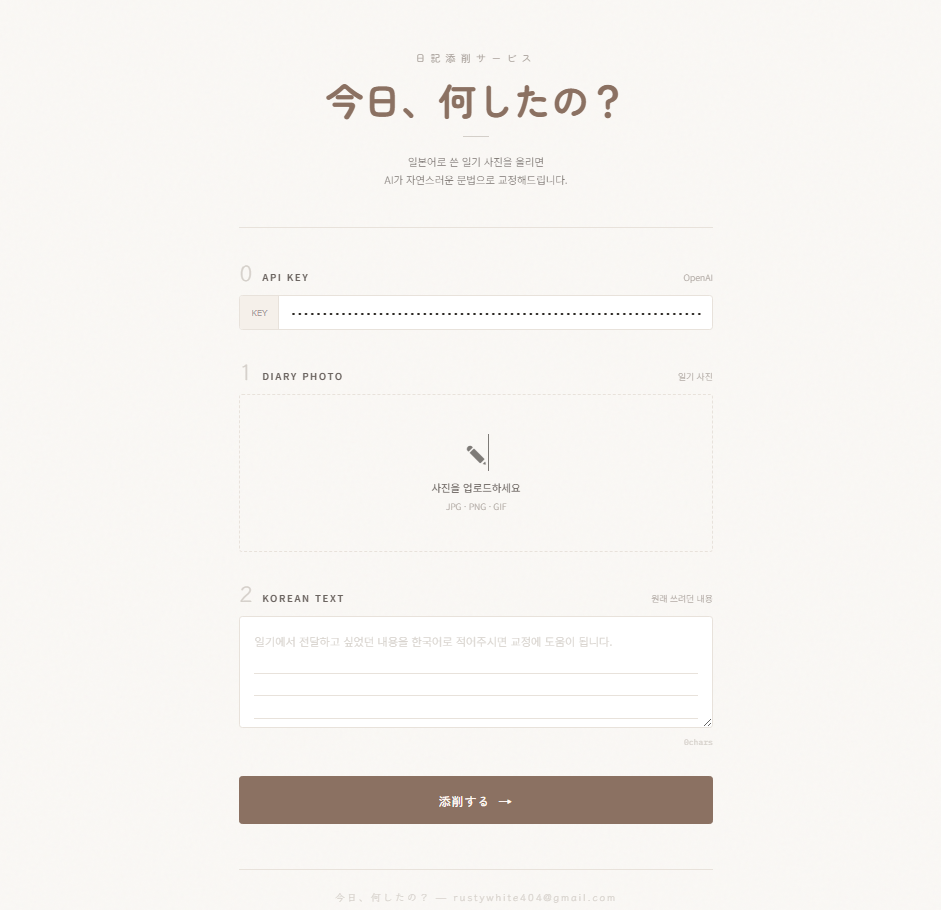
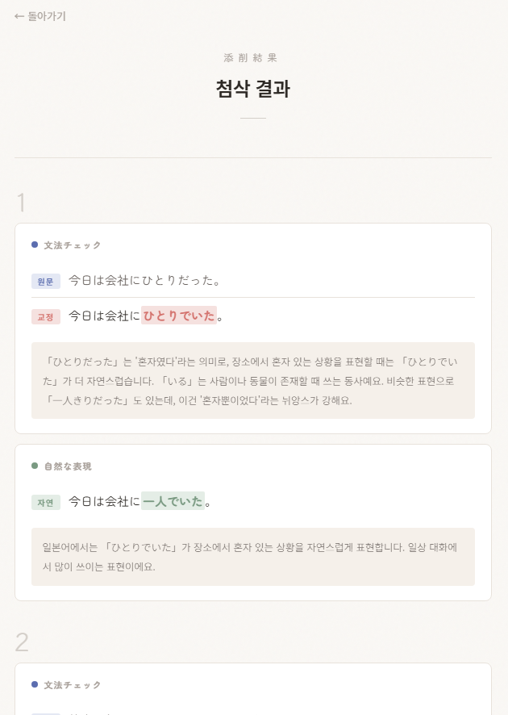

# 今日、何したの？ — ndiary



일본어 손글씨 일기를 사진으로 찍어 올리면, AI가 문법 교정과 자연스러운 표현을 제안해주는 일기 첨삭 서비스입니다.  
일본어 공부를 하면서 직접 쓴 일기를 편리하게 교정받고 싶다는 개인적인 필요에서 시작했습니다. 동시에 바이브 코딩으로 작은 서비스를 처음부터 끝까지 만들어보며, AI 기반 개발에서 어떤 설계 판단과 프롬프트 설계가 필요한지 직접 경험해보는 것이 목표였습니다.

**https://rustywhite404.github.io/ndiary/**

---

## 사용법

| 단계 | 설명 |
|------|------|
| **0. API Key** | OpenAI API 키를 입력합니다. 한 번 입력하면 브라우저에 저장되어 다시 입력할 필요가 없습니다. <br> [OpenAI Platform](https://platform.openai.com/api-keys)에서 발급받을 수 있습니다. |
| **1. Diary Photo** | 손으로 쓴 일본어 일기 사진을 업로드합니다. 클릭하여 파일을 선택하거나, `Ctrl+V`로 클립보드 이미지를 바로 붙여넣을 수 있습니다. |
| **2. Korean Text** | 일기에서 전달하고 싶었던 내용을 한국어로 작성합니다. AI가 의도를 파악하는 데 사용됩니다. |
| **添削する** | 버튼을 누르면 AI가 문장 단위로 분석을 시작합니다. |

### 결과 화면



문장별로 두 가지 영역으로 나뉘어 결과가 표시됩니다.

- **文法チェック** — 원문, 교정된 문장, 수정 이유와 학습 팁
- **自然な表現** — 원어민이 실제로 쓸 법한 자연스러운 표현과 그 이유

수정된 부분은 색상으로 하이라이트되어 한눈에 확인할 수 있습니다.

---

## 동작 방식

```
index.html                          result.html
┌──────────────┐    sessionStorage    ┌──────────────┐
│  사진 업로드   │ ──── 결과 JSON ────▶ │  문장별 카드   │
│  한국어 입력   │                     │  교정 / 자연   │
│  OpenAI API  │                     │  하이라이트    │
└──────────────┘                     └──────────────┘
```

1. 사용자가 업로드한 이미지를 Base64로 인코딩
2. 한국어 텍스트와 함께 OpenAI `gpt-4o` Vision API로 전송
3. AI가 사진에서 일본어 텍스트를 읽고, 문장 단위로 교정 결과를 JSON으로 반환
4. 결과를 `sessionStorage`에 저장한 뒤 `result.html`로 이동하여 렌더링

---

## 기술 스택  
'보여주기 위한' 기술 스택 사용보다는 서비스 규모와 목적에 맞는 간단한 구현을 목표로 했습니다.  
- **순수 HTML / CSS / JavaScript** — 프레임워크, 빌드 도구 사용하지 않음 
- **OpenAI Chat Completions API** — gpt-4o 모델, Vision(이미지 인식) 기능 사용
- **GitHub Pages** — 정적 호스팅, 서버 불필요

---

## 고민한 부분

### 기획

- **학습 친화적 프롬프트** — AI의 역할을 "한국인 초보자를 가르치는 친절한 일본어 선생님"으로 설정했습니다. 단순 교정이 아니라 관련 문법 포인트, 자주 하는 실수 패턴, 원어민이 해당 표현을 쓰는 상황 등 학습에 도움이 되는 정보를 함께 제공합니다.
- **2단계 첨삭 구조** — 문법 교정과 자연스러운 표현을 분리하여, 학습자가 "틀린 부분"과 "더 좋은 표현"을 구분해서 익힐 수 있도록 했습니다.
- **한국어 중심 설명** — 교정 설명은 한국어로, 일본어 인용은 「」로 구분합니다. 한자로 쓸 수 있는 부분은 한자 표기로 교정하여 실제 일본어 환경에 가까운 결과를 제공합니다.
- **한국어 에러 메시지** — OpenAI API 에러를 정규식 패턴 매칭(`ERROR_PATTERNS`)으로 한국어로 번역합니다. "API key not valid" 대신 "API 키를 잘못 입력하셨습니다" 같은 안내를 보여줍니다.

### UI

- **문장 단위 카드 UI** — AI 응답을 한꺼번에 보여주는 대신 문장별로 카드를 나누어, 한 문장씩 원문 → 교정 → 설명 흐름을 따라갈 수 있도록 구성했습니다. 긴 첨삭 결과도 시선이 흐트러지지 않고 하나씩 집중해서 읽을 수 있습니다.
- **수정 부분 색상 하이라이트** — 교정된 부분은 분홍색, 자연스러운 표현으로 바뀐 부분은 초록색으로 하이라이트하여 변경점을 직관적으로 파악할 수 있습니다.
- **다크 모드 대응** — 시스템 설정에 따라 자동으로 다크 모드가 적용됩니다. 폼 입력 필드, placeholder 텍스트 등 세부 요소까지 가독성을 고려하여 색상을 조정했습니다.
- **API 키 자동 저장** — `localStorage`에 저장하여 재방문 시 다시 입력할 필요가 없습니다. 키는 브라우저에서 OpenAI 서버로 직접 전송되며, 별도의 백엔드를 거치지 않습니다.
- **클립보드 이미지 붙여넣기** — `Ctrl+V`로 클립보드의 이미지를 바로 업로드할 수 있습니다. 스크린샷이나 다른 앱에서 복사한 이미지를 빠르게 붙여넣을 수 있어 편리합니다.
- **유효성 검사 모달** — 빈 필드가 있을 때 어떤 단계를 빠뜨렸는지 단계 번호와 함께 모달로 안내합니다.

### 개발

- **프레임워크 없는 구조** — React 등의 프레임워크 없이 순수 HTML/JS로 구현했습니다. `file://` 프로토콜에서도 CORS 문제 없이 동작하며, 별도의 빌드 과정이 필요하지 않습니다.
- **CSS Custom Properties 테마 시스템** — `:root`에 정의된 CSS 변수(`--paper`, `--ink`, `--surface` 등)로 색상 체계를 관리합니다. `prefers-color-scheme: dark` 미디어 쿼리로 다크 모드 전환 시 변수 값만 교체됩니다.
- **재사용 가능한 모달** — `showAlert({ icon, title, body, btn })` 함수로 모달을 추상화하여 유효성 검사(`showValidation`)와 에러 알림(`showErrorAlert`)에서 동일한 컴포넌트를 재사용합니다.
- **안정적인 JSON 파싱** — OpenAI API에 `response_format: { type: 'json_object' }`를 지정하여 JSON 응답을 보장하고, 파싱 실패 시 정규식으로 JSON 블록을 추출하는 2단계 파싱 전략을 사용합니다.
- **XSS 방지** — API 응답을 `escapeHtml()`로 이스케이프한 뒤, `**...**` 마커만 선택적으로 `<span>` 태그로 변환합니다. HTML 삽입 공격을 방지하면서도 하이라이트 기능을 유지합니다.

---

## 파일 구조

```
ndiary/
├── index.html     # 메인 페이지 (입력 폼, 모달)
├── result.html    # 결과 페이지 (첨삭 결과 표시)
├── style.css      # 전체 스타일 (라이트/다크 모드)
├── app.js         # 메인 로직 (업로드, 유효성 검사, API 호출)
└── result.js      # 결과 렌더링 (카드 생성, 하이라이트)
```

---

## 로컬에서 실행하기

별도의 설치나 빌드가 필요하지 않습니다. `index.html`을 브라우저에서 직접 열면 됩니다.

> OpenAI API 키가 필요합니다. [OpenAI Platform](https://platform.openai.com/api-keys)에서 발급받을 수 있습니다.
